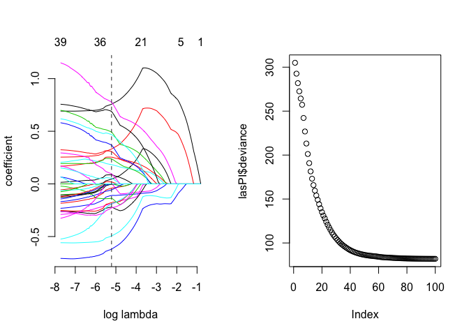

# Food Inflation Analysis 2
Mo  
September 8, 2015  


```r
load("data.Rdata")
source("0_naref.r")
require(ggplot2)
```

```
## Loading required package: ggplot2
```

```r
require(gamlr)
```

```
## Loading required package: gamlr
## Loading required package: Matrix
```

```r
require(zoo)
```

```
## Loading required package: zoo
## 
## Attaching package: 'zoo'
## 
## The following objects are masked from 'package:base':
## 
##     as.Date, as.Date.numeric
```

```r
require(reshape2)
```

```
## Loading required package: reshape2
```


```r
priceIndex <- function (X){
  
  ## Given an X (df) return the exp(coefficients) on  month ##

  Y <- X$normalized_price
  X <- sparse.model.matrix(normalized_price ~ . , data=X)[,-1] # -1 to drop intercept
  
  lasPI <- gamlr(X,log(Y), lambda.min.ratio=1e-3)
  par(mfrow=c(1,2))
  plot(lasPI); plot(lasPI$deviance)
  allB <- coef(lasPI)[-1,]; 
  # Collect the Bs for time
  yrB <- allB[which(grepl("yr",names(allB)))]
  save <- data.frame(yrB=unname(exp(yrB)/exp(yrB[1])), 
                     yrmonth=unname(sapply(names(yrB),function(x) gsub("monyr", "",x))))
  save$yrmonth <- factor(as.yearmon(save$yrmonth))
  save
}

data <- naref(data)
selected <- c("normalized_price", "monyr", "p_item_uuid","weekday", "p_quantity", "p_size", "city", "u_uuid", "l_place_uuid")
X <- data[,c(selected)]

# Run the function for each city
Bs <- by(X, X$city, priceIndex)
```

      

```r
# Fix the silly rownames
temp <- do.call(rbind,Bs)
temp$city <- rownames(temp)
temp$city <- gsub(".[0-9]+", "",temp$city) 

# Plot em
temp <- melt(temp)
```

```
## Using yrmonth, city as id variables
```

```r
temp$yrmonth <- factor(as.yearmon(temp$yrmonth))
ggplot(temp)+
  geom_point(data=temp, aes(yrmonth,value,color=factor(city), group=factor(city))) +
  geom_line(data=temp, aes(yrmonth,value,color=factor(city), group=factor(city))) +
  xlab("")+ylab("price index")+
  theme(legend.title=element_blank())
```

 

Path plots show we are not selecting the most complicated models.  
It looks like all the price inflation was in 1 city.  
Checking the food inflation by item is as simple as changing the segment to subset by in `Bs <- by(X, X$p_item_product_lc, priceIndex)`
